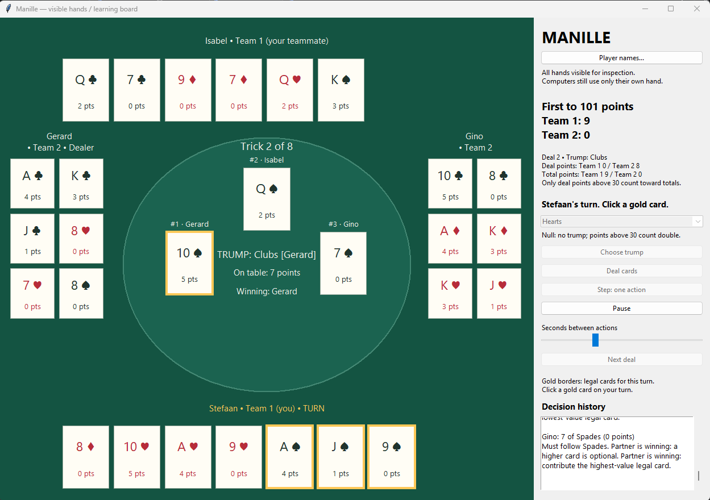

## Screenshot



The most popular card game in Flanders, Belgium, is now available — with source code — for the world! (06-Oct-2026)

With this app, learning Manille becomes easy.

The game is played with four players, and you are one of them. The game uses a 32-card deck.

## Requirements

Choose a local Python installation for the graphical board, or [Docker for console mode](#run-with-docker-no-local-python-required).

- Python **3.10 or newer**. The app has been tested with Python 3.13.2.
- Tkinter for the graphical board. It is normally included with Python installers from [python.org](https://www.python.org/downloads/) on Windows and macOS. Some Linux distributions require a separate Tkinter package.
- A desktop session to display the board. Console mode works without Tkinter.

The app uses only Python's standard library. No `pip install` command or virtual environment is required. GitHub hosts the source code; download it and run it on your computer.

## Download the app

Choose either method:

### Download ZIP (no Git required)

1. Open [the GitHub repository](https://github.com/meeuwsstefaan/ManilleCardGame).
2. Click **Code → Download ZIP**.
3. Extract the ZIP file. Do not run the app from inside the ZIP.
4. Open a terminal in the extracted folder containing `manille.py`, usually named `ManilleCardGame-main`.

### Clone with Git

If Git is installed, run:

```sh
git clone https://github.com/meeuwsstefaan/ManilleCardGame.git
cd ManilleCardGame
```

## Start the graphical board

Run the command for your operating system from the folder containing `manille.py`.

**Windows — PowerShell or Command Prompt:**

```powershell
py -3 manille.py
```

If the `py` launcher is unavailable, use `python manille.py` instead. Check `python --version` to confirm it is Python 3.10 or newer.

**macOS or Linux — Terminal:**

```sh
python3 manille.py
```

### Play a game

1. Click the deck to perform one **Hindu shuffle**. Small packets of 1–5 cards are pulled from the top into a receiving hand, each landing on top of the previous packet. The final 3–6 cards are placed on top to complete the shuffle. Cards retain their order within each packet. The 32-card preview updates immediately; click again for another shuffle if desired.
2. Click **Deal cards**. The current deck is dealt in 3–2–3 packets, starting left of the dealer.
3. If you are the dealer, select a suit or **Null**, then click **Choose trump**. Otherwise, use **Step: one action** or **Auto-play** to let the computer choose.
4. If offered a chance to join trump, select the checkbox to join or leave it unchecked to pass, then click **Confirm choice / pass**.
5. Use **Step: one action** to advance the computers one action at a time, or **Auto-play** to let them continue automatically. Auto-play waits for your choices.
6. On your turn, click a card with a **gold border**. These are the legal cards. All hands are visible for learning.
7. After a deal, click **Next deal**, shuffle the deck, and click **Deal cards** again. The board match ends when a team reaches 101 counted points.

Use **Player names...** to change names; they remain in place between deals.

Below the deck, all **32 cards** appear in their current order, numbered 1 to 32. Read left to right across the top row, then the bottom row; card 1 is dealt first. **Deal cards** uses that exact order. The board does not shuffle automatically: the first deck starts in suit/rank order, and later decks start in the order collected from the previous deal.

Click **Show Last Hand** to view the most recently completed trick on the board, including all four cards, the players, winner, trump, and trick number. The button is disabled at startup and during shuffling for a new deal. The saved trick is cleared when a new deal starts, and the button becomes available after that deal's first trick is completed and its animation finishes. Viewing it pauses auto-play. Click **Back to Game** to return, then restart **Auto-play** if desired. This uses the existing window and does not open a pop-up.

Each completed trick is added to the game deck in the order its cards were played. After all eight tricks, those same 32 collected cards are used for the next deal's shuffling. This also applies in console and Docker mode.

If an opponent trumps a non-trump lead and you can follow the led suit, every card of that suit is legal, including lower cards. You must still follow suit. When trump itself is led, overtrumping remains mandatory when possible.

Following suit is always mandatory. If you cannot follow and your partner is winning, you may discard another suit instead of playing trump. This applies whether your partner is winning with the led suit or with trump. If you choose to trump, lower trumps are allowed only when forced. When an opponent is winning, you must play trump if unable to follow and holding trump, and overtrump when possible.

If any player's initial eight-card hand has zero points, the board pauses before trump selection and shows an **Info: zero-point hand — restart deal** button. Click it to return to shuffling, then choose **Deal cards** again. The same dealer, deal number, names, and match totals are retained. This check applies only immediately after dealing. In human console mode, press Enter to acknowledge the notice and redeal; computer-only console games redeal automatically.

## Play in a browser

From this project folder on Windows, run:

```powershell
py -3 play_web.py
```

On macOS/Linux use `python3 play_web.py`. The launcher serves only `web/` at
`http://127.0.0.1:8765/` and opens your browser. Stop it with Ctrl+C. Use
`--no-browser` to open the address yourself, or `--port 8766` if the port is busy.

The browser version plays entirely in JavaScript. It includes the desktop's
current card legality, Null, opponent joining trump, computer card/trump/join
choices, and scoring to 101. The scoreboard shows counted match points;
raw deal points appear separately. Null or joined trump doubles only the
points above 30, once. Joining waits for your choice before any cards are played.
An initial zero-point hand requires a redeal with the same dealer and scores.
Reloading clears the match scores, but the last completed deal's collected deck
is saved in browser storage for the same address. **New game** also retains that
collected deck. An ordered fresh deck is used only before any collected deck is
available. Click the deck for one animated Hindu shuffle, inspect all 32 numbered
cards below it, then click **Deal cards**. That exact order is dealt in 3-2-3
packets. Additional deck clicks perform additional shuffles. The preview updates
when the animation finishes; dealing and extra shuffle clicks wait until then.
**Next deal** brings back the deck in the order collected from completed tricks,
with the dealer rotated and match scores retained. Zero-point redeals return to
the same shuffle stage without changing the dealer, deal number, or scores.
The preview labels the collected order and changes to "Shuffled order" after a
shuffle. It renders the same deck that **Deal cards** uses. If browser storage is
unavailable, collection order is still retained while the page remains open.
After every completed trick, its four cards gather into a small stack and slide
to the winning player's seat. Controls wait for collection to finish, including
on the final trick of a deal or match. Reduced-motion settings show the stack
at its destination without the movement.

The static `web/` folder can later be served at a subdirectory such as
`https://101net.dev/manille/`; its assets use relative URLs and need no Python
server in production. It has not been published. The page requests no search
indexing; an unlinked address remains accessible to anyone who knows the URL.

Browser rule tests require Node.js and use no additional packages:

```sh
node --test web/engine.test.mjs web/app.test.mjs
```

With Node.js available, `py -3 -m unittest test_web_parity` also compares
3,200 browser card decisions, 610 scoring cases, and 100 Hindu shuffles directly
with `manille.py`.

## Other run modes

In the browser, **Show Last Hand** reviews the last collected trick in the center of the table, with its winning card highlighted in gold. Play pauses during review; **Back to Game** restores the current trick and the previous pause/resume state. The review resets for each new deal.

In Null, an opponent's opening 10 cannot be beaten. Computers therefore play the lowest-value legal card against it, breaking ties by lowest rank. They must still follow suit, even if an off-suit card is cheaper. When a partner leads the 10, they feed points as usual; other Null situations retain the highest-value legal-card strategy. This applies in both the browser and desktop games.

The computer that chose a trump suit prefers to lead and play legal cards of that suit. Within those legal trump cards, its usual point-value strategy still applies. Following suit and other mandatory rules take precedence, and Null strategy is unchanged. Human trump choosers receive a recommendation on the board and retain manual choice.

When the opposing team chose trump, computers prefer legal non-trump cards, even instead of a trump 10. Mandatory following, trumping, and overtrumping take precedence; trump cards are still played when they are the only legal options. If your own team chose trump, this avoidance preference does not apply. Null strategy and human manual choice remain unchanged.

Computers remember suits that opponents have trumped during the current deal and avoid playing those suits whenever a legal alternative exists, including leading another suit instead of a vulnerable 10. Both partners share this observation. Mandatory following, trumping, and overtrumping still apply; if only cards of an avoided suit are legal, the computer plays one. This memory resets each deal, Null strategy is unchanged, and human players retain manual choice.

These examples use the Windows Python launcher. On macOS or Linux, replace `py -3` with `python3`.

**Watch four computer players on the board:**

```powershell
py -3 manille.py --auto --seed 42
```

Click the deck if you want to shuffle, click **Deal cards**, then click **Auto-play**. The `--auto` option selects four computer players; you still control the board buttons. The seed makes the deck sequence repeatable when you use the same number of shuffles.

**Play one deal in the terminal:**

```powershell
py -3 manille.py --console --deals 1
```

Enter the numbered choices shown in the terminal.

**Run three computer-only deals in the terminal:**

```powershell
py -3 manille.py --console --auto --deals 3 --seed 42
```

**Show all command-line options:**

```powershell
py -3 manille.py --help
```

## Run from PyCharm

1. Open the extracted or cloned project folder in PyCharm.
2. Configure a Python 3.10 or newer interpreter with Tkinter available. PyCharm may create a virtual environment; no extra Python packages are needed.
3. Open `manille.py`, right-click in the editor, and select **Run 'manille'**.

## Run with Docker (no local Python required)

Install and start [Docker Desktop](https://www.docker.com/products/docker-desktop/) on Windows/macOS, or Docker Engine on Linux. On Windows, use Linux containers. Python runs inside the container; you do not need to install Python on your computer.

Download or clone the repository as described above, then open a terminal in the folder containing `Dockerfile` and `manille.py`.

**Build the image:**

```sh
docker build -t manille-card-game .
```

The first build downloads the Python base image and requires internet access. Rebuild after changing `manille.py` to include the changes in the image.

**Play one deal yourself:**

```sh
docker run --rm -it manille-card-game --deals 1
```

Enter the numbered choices shown in your terminal. The `-it` options enable interactive input. To play multiple deals with a prompt between them, use a seed without a deal limit:

```sh
docker run --rm -it manille-card-game --seed 42
```

**Watch three computer-only deals (the default):**

```sh
docker run --rm manille-card-game
```

**Choose the number of computer-only deals and a seed:**

```sh
docker run --rm manille-card-game --auto --deals 5 --seed 42
```

**Show the available options:**

```sh
docker run --rm manille-card-game --help
```

The image always starts in console mode. It does not display the Tkinter board or its animations. Running a Tkinter window from a container requires additional display-server setup; use the local Python instructions above for the graphical board. These Docker commands do not require port mappings or shared folders. Each container is removed on exit by `--rm`; match totals last only for that run.

## Troubleshooting

- **Python command not found:** install Python from [python.org](https://www.python.org/downloads/), then reopen your terminal. On Windows, enable the installer options for the Python launcher and adding Python to PATH when offered.
- **Cannot find `manille.py`:** change to the extracted or cloned project folder before running the command.
- **Tkinter missing:** test it with `py -3 -m tkinter` on Windows or `python3 -m tkinter` on macOS/Linux. A small test window should open. On Ubuntu/Debian using the distribution's Python, install it with `sudo apt install python3-tk`. Other Linux distributions or custom Python installations need the Tkinter package matching their interpreter.
- **No graphical display available:** use `--console`, or run the board in a desktop session.

## Run the tests (optional)

From the project folder:

```powershell
py -3 -m unittest test_manille test_board_ui
```

On macOS/Linux, replace `py -3` with `python3`. Board tests open temporary windows and are skipped if Tkinter or a graphical display is unavailable.
